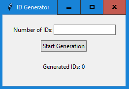

# Random ID Generator

This project is a Python-based application to generate unique 12-digit IDs, store them in an SQLite database, and export them to a CSV file. The application also includes a GUI built with Tkinter to interactively generate IDs and monitor progress.

## Features

- Generate unique 12-digit IDs.
- Store IDs in an SQLite database to ensure uniqueness.
- Export generated IDs to a CSV file.
- Interactive GUI for generating IDs and monitoring progress.
- Separate script to check for duplicate IDs in the database.

## Screenshot



## Prerequisites

- Python 3.x
- Tkinter (usually included with Python installations)

## Installation

1. Clone the repository:
    ```bash
    git clone https://github.com/mofasuhu/random-id-generator.git
    cd random-id-generator
    ```

2. Install any necessary dependencies (if any):
    ```bash
    pip install -r requirements.txt
    ```

## Usage

1. **Run the ID Generator:**
    - Execute the `randomIDs.exe` file (for Windows users):
      ```bash
      ./randomIDs.exe
      ```

    - Alternatively, run the Python script:
      ```bash
      python randomIDs.py
      ```

2. **Generate IDs:**
    - Enter the number of IDs you want to generate in the GUI.
    - Click the "Start Generation" button.
    - The counter will update as IDs are generated and stored in the database.

3. **Check for Duplicate IDs:**
    - Use the `check_duplicates.py` script to ensure there are no duplicate IDs in the database:
      ```bash
      python check_duplicates.py
      ```

## Files

- `randomIDs.py`: The main script to generate and store unique IDs.
- `randomIDs.exe`: Executable version of the `randomIDs.py` script.
- `check_duplicates.py`: Script to check for duplicate IDs in the database.
- `LICENSE`: The license for the project.
- `README.md`: This file.
- `requirements.txt`: List of dependencies (if any).

## License

This project is licensed under the MIT License - see the [LICENSE](LICENSE) file for details.

## Contributing

Feel free to fork this project, make improvements, and submit pull requests. Any contributions are greatly appreciated!
